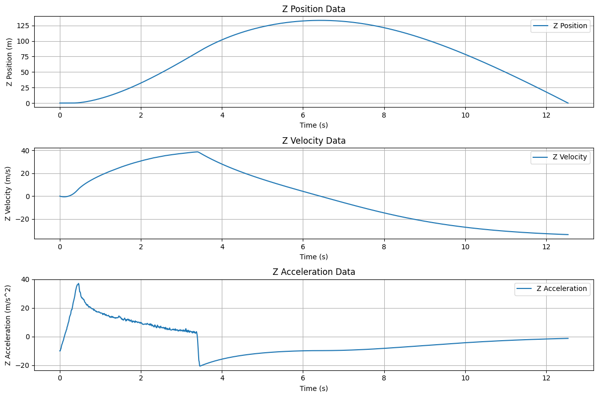
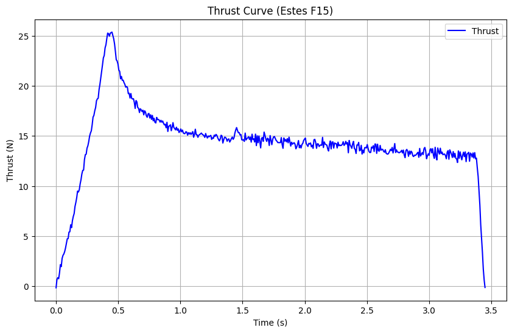

# Simple TVC Rocket Simulation

This is a simulation for a simple TVC model rocket with 3 degrees of freedom and a simple thrust curve

# Reference
- [Modeling a Thrust Vectored Rocket In Simulink](https://www.youtube.com/watch?v=nwgd1CV__rs&t)
- [Thrust vectoring](https://en.wikipedia.org/wiki/Thrust_vectoring)
